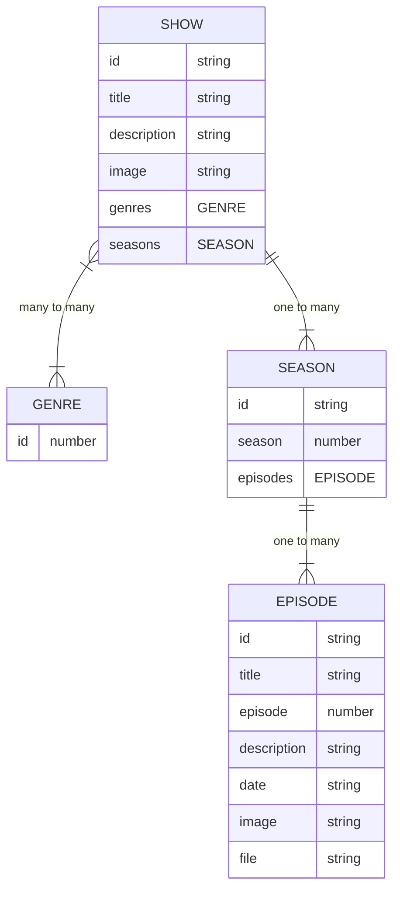

<!-- omit in toc -->
# Epic Stream API

## 📦Data

**Data consists of these three entities**

- **`Show`**: A specific TV Show has a single or several **`Seasons`**
- **`Season`**: A collection of **`Episodes`** released across a specific
  timespan
- **`Episode`**: Corresponds to a specific MP4 file that user can watch

### Endpoints

The above is exposed through two endpoints that can be called via a `fetch`
request. 

Note that  ***`<SHOW_ID>`** indicates where the dynamic ID for a reqested show
should be placed. For example:
`[https://epic-stream-api.netlify.app/show/7099db11-b5e3-47db-8945-7f4f86c7c504](https://epic-stream-api.netlify.app/show/7099db11-b5e3-47db-8945-7f4f86c7c504)`* 

| URL                                                  |                                                                                                                                                                                                                                                                                 |
| ---------------------------------------------------- | ------------------------------------------------------------------------------------------------------------------------------------------------------------------------------------------------------------------------------------------------------------------------------- |
| `https://epic-stream-api.netlify.app`                | Returns an array of **`Show`** preview objects. These contain limited information, however the returned `id` property can be used to call the specific show endpoint. Note that instead of the actual *Seasons*, a number is returned indicating how many *Seasons* a show has. |  |
| `https://epic-stream-api.netlify.app/show/<SHOW_ID>` | Returns a **`Show`** object with several **`Season`** objects directly embedded  inside. Note that each **`Seasion`** object further has an array of **`Episode`** objects embedded inside.                                                                                     |

### Relationships

The following chart indicates the relations between units of data. It uses
Entity Relationship mapping. In order to understand the meaning of symbols in
the chart please read [the overview on the Mermaid.js
documentation](https://mermaid.js.org/syntax/entityRelationshipDiagram.html). 

### Genre Titles

Since genre information is only exposed by means of the specific `GENRE` id, it
is recommended that you include the mapping between genre id values and title in
your code itself:

| ID  | Title       |
| --- | ----------- |
| 1   | Crime       |
| 2   | Drama       |
| 3   | Thriller    |
| 4   | Documentary |
| 5   | Nature      |
| 6   | War         |
| 7   | History     |
| 8   | Animation   |
| 9   | Action      |
| 10  | Adventure   |
| 11  | Science     |
| 12  | Family      |
| 13  | Biography   |
| 14  | Sport       |
| 15  | Fantasy     |
| 16  | Horror      |
| 17  | Mystery     |
| 18  | Comedy      |
| 19  | Sci-Fi      |
| 20  | Music       |
| 21  | News        |
| 22  | Talk Show   |
| 23  | Romance     |
| 24  | Game Show   |
